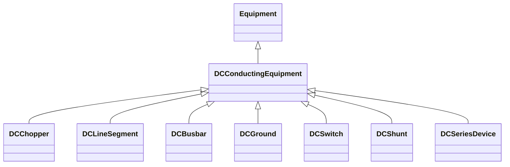

# DCConductingEquipment

The parts of the DC power system that are designed to carry current or that are conductively connected through DC terminals.

## Inheritance

<button class="mermaid-enlarge-button">Enlarge Diagram</button>

## Attributes

| Label | Type | Multiplicity | Comment |
|-------|------|--------------|---------|
| DCTerminals | [DCTerminal](DCTerminal.md) | 0..n | A DC conducting equipment has DC terminals. |
| ratedUdc | Float | 1..1 | Rated DC device voltage. The attribute shall be a positive value. It is configuration data used in power flow. |

