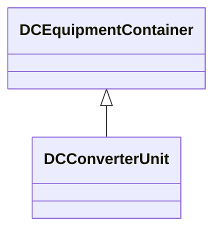

# DCConverterUnit

Indivisible operative unit comprising all equipment between the point of common coupling on the AC side and the point of common coupling - DC side, essentially one or more converters, together with one or more converter transformers, converter control equipment, essential protective and switching devices and auxiliaries, if any, used for conversion.

## Inheritance

<button class="mermaid-enlarge-button">Enlarge Diagram</button>

## Attributes

| Label | Type | Multiplicity | Comment |
|-------|------|--------------|---------|
| Substation | [Substation](Substation.md) | 0..1 | The containing substation of the DC converter unit. |
| operationMode | [DCConverterOperatingModeKind](DCConverterOperatingModeKind.md) | 1..1 | The operating mode of an HVDC bipole (bipolar, monopolar metallic return, etc). |

