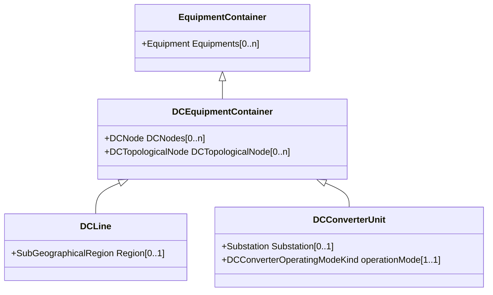

# DCEquipmentContainer

A modelling construct to provide a root class for containment of DC as well as AC equipment. The class differ from the EquipmentContaner for AC in that it may also contain DCNode-s. Hence it can contain both AC and DC equipment.

## Inheritance

<button class="mermaid-enlarge-button">Enlarge Diagram</button>

## Attributes

| Label | Type | Multiplicity | Comment |
|-------|------|--------------|---------|
| DCNodes | [DCNode](DCNode.md) | 0..n | The DC nodes contained in the DC equipment container. |
| DCTopologicalNode | [DCTopologicalNode](DCTopologicalNode.md) | 0..n | The topological nodes which belong to this connectivity node container. |

