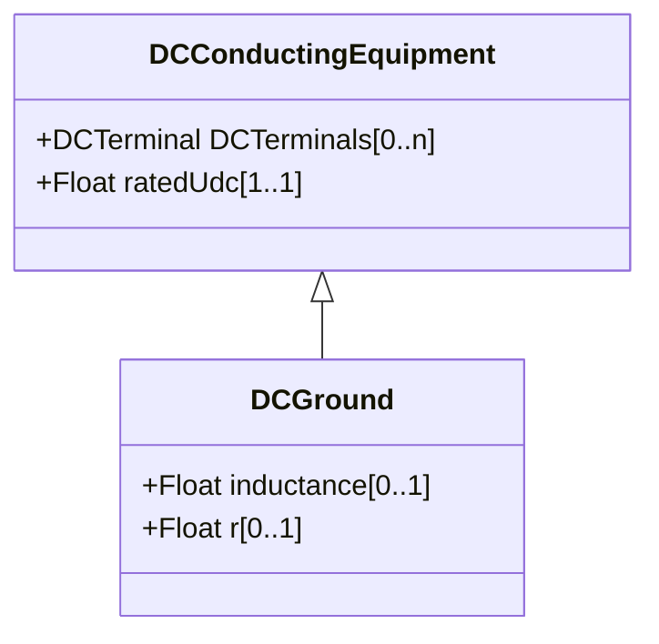

# DCGround

A ground within a DC system.

## Inheritance

<button class="mermaid-enlarge-button">Enlarge Diagram</button>

## Attributes

| Label | Type | Multiplicity | Comment |
|-------|------|--------------|---------|
| inductance | Float | 0..1 | Inductance to ground. |
| r | Float | 0..1 | Resistance to ground. |

