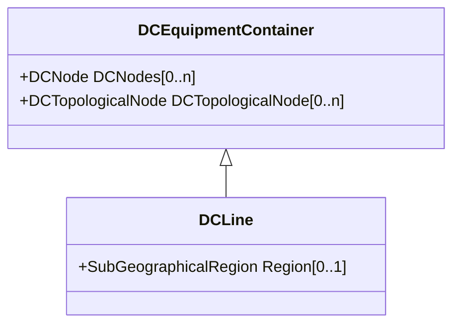

# DCLine

Overhead lines and/or cables connecting two or more HVDC substations.

## Inheritance

<button class="mermaid-enlarge-button">Enlarge Diagram</button>

## Attributes

| Label | Type | Multiplicity | Comment |
|-------|------|--------------|---------|
| Region | [SubGeographicalRegion](SubGeographicalRegion.md) | 0..1 | The SubGeographicalRegion containing the DC line. |

