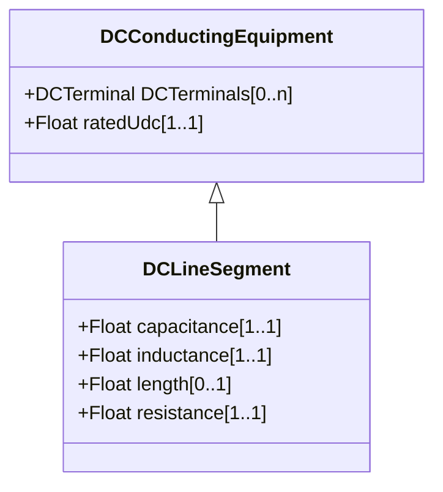

# DCLineSegment

A wire or combination of wires not insulated from one another, with consistent electrical characteristics, used to carry direct current between points in the DC region of the power system.

## Inheritance

<button class="mermaid-enlarge-button">Enlarge Diagram</button>

## Attributes

| Label | Type | Multiplicity | Comment |
|-------|------|--------------|---------|
| capacitance | Float | 1..1 | Capacitance of the DC line segment. Significant for cables only. |
| inductance | Float | 1..1 | Inductance of the DC line segment. Negligible compared with DCSeriesDevice used for smoothing. |
| length | Float | 0..1 | Segment length for calculating line section capabilities. |
| resistance | Float | 1..1 | Resistance of the DC line segment. |

