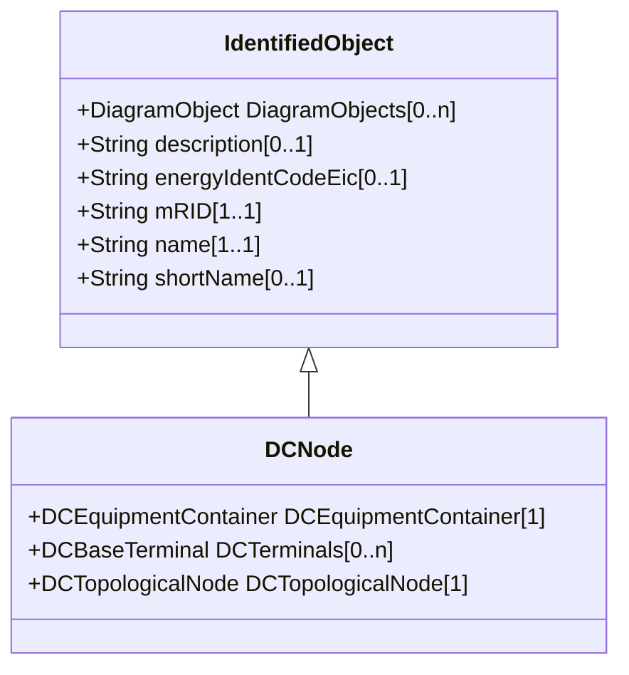

# DCNode

DC nodes are points where terminals of DC conducting equipment are connected together with zero impedance.

## Inheritance

<button class="mermaid-enlarge-button">Enlarge Diagram</button>

## Attributes

| Label | Type | Multiplicity | Comment |
|-------|------|--------------|---------|
| DCEquipmentContainer | [DCEquipmentContainer](DCEquipmentContainer.md) | 1 | The DC container for the DC nodes. |
| DCTerminals | [DCBaseTerminal](DCBaseTerminal.md) | 0..n | DC base terminals interconnected with zero impedance at a this DC connectivity node. |
| DCTopologicalNode | [DCTopologicalNode](DCTopologicalNode.md) | 1 | The DC topological node to which this DC connectivity node is assigned. May depend on the current state of switches in the network. |

