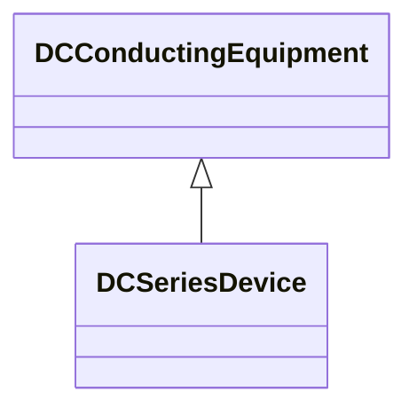

# DCSeriesDevice

A series device within the DC system, typically a reactor used for filtering or smoothing. Needed for transient and short circuit studies.

## Inheritance

<button class="mermaid-enlarge-button">Enlarge Diagram</button>

## Attributes

| Label | Type | Multiplicity | Comment |
|-------|------|--------------|---------|
| inductance | Float | 1..1 | Inductance of the device. |
| resistance | Float | 1..1 | Resistance of the DC device. |

