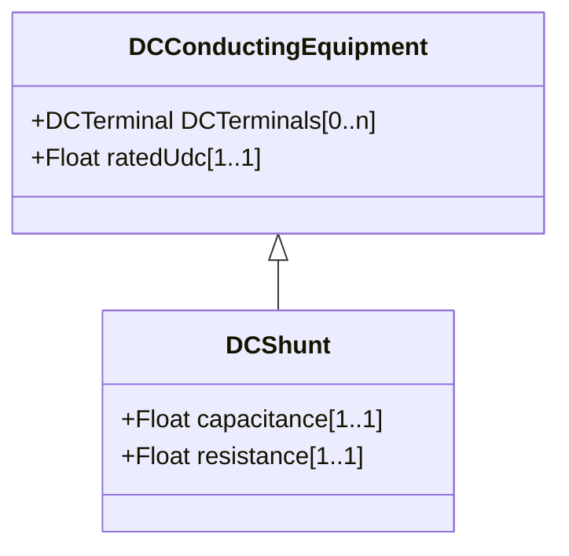

# DCShunt

A shunt device within the DC system, typically used for filtering. Needed for transient and short circuit studies.

## Inheritance

<button class="mermaid-enlarge-button">Enlarge Diagram</button>

## Attributes

| Label | Type | Multiplicity | Comment |
|-------|------|--------------|---------|
| capacitance | Float | 1..1 | Capacitance of the DC shunt. |
| resistance | Float | 1..1 | Resistance of the DC device. |

