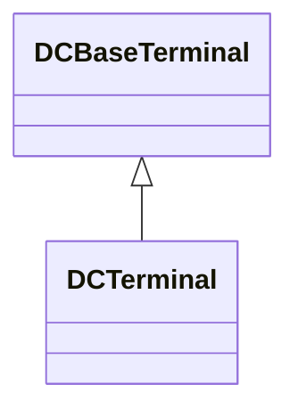

# DCTerminal

An electrical connection point to generic DC conducting equipment.

## Inheritance

<button class="mermaid-enlarge-button">Enlarge Diagram</button>

## Attributes

| Label | Type | Multiplicity | Comment |
|-------|------|--------------|---------|
| DCConductingEquipment | [DCConductingEquipment](DCConductingEquipment.md) | 1 | An DC terminal belong to a DC conducting equipment. |

