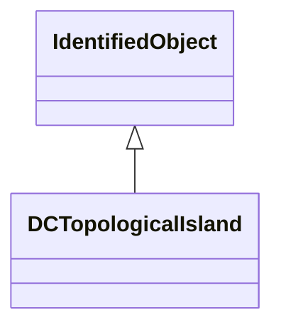

# DCTopologicalIsland

An electrically connected subset of the network. DC topological islands can change as the current network state changes, e.g. due to: - disconnect switches or breakers changing state in a SCADA/EMS. - manual creation, change or deletion of topological nodes in a planning tool. Only energised TopologicalNode-s shall be part of the topological island.

## Inheritance

<button class="mermaid-enlarge-button">Enlarge Diagram</button>

## Attributes

| Label | Type | Multiplicity | Comment |
|-------|------|--------------|---------|
| DCTopologicalNodes | [DCTopologicalNode](DCTopologicalNode.md) | 1..n | The DC topological nodes in a DC topological island. |

