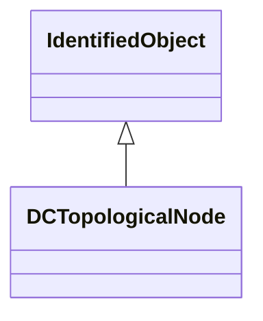

# DCTopologicalNode

DC bus.

## Inheritance

<button class="mermaid-enlarge-button">Enlarge Diagram</button>

## Attributes

| Label | Type | Multiplicity | Comment |
|-------|------|--------------|---------|
| DCEquipmentContainer | [DCEquipmentContainer](DCEquipmentContainer.md) | 1 | The connectivity node container to which the topological node belongs. |
| DCNodes | [DCNode](DCNode.md) | 0..n | The DC connectivity nodes combined together to form this DC topological node. May depend on the current state of switches in the network. |
| DCTerminals | [DCBaseTerminal](DCBaseTerminal.md) | 0..n | See association end TopologicalNode.Terminal. |
| DCTopologicalIsland | [DCTopologicalIsland](DCTopologicalIsland.md) | 0..1 | A DC topological node belongs to a DC topological island. |

