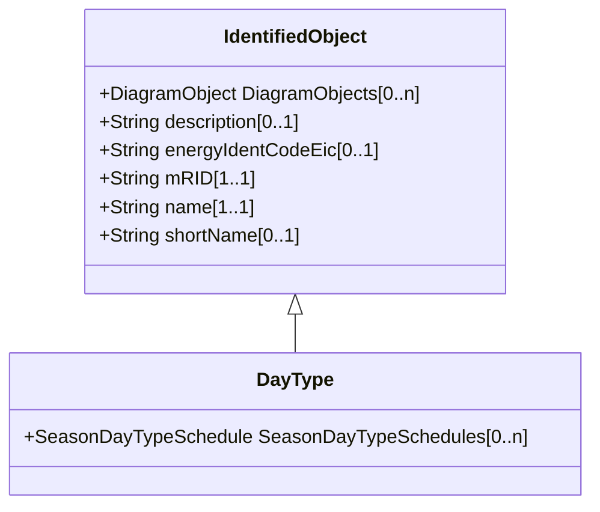

# DayType

Group of similar days. For example it could be used to represent weekdays, weekend, or holidays.

## Inheritance

<button class="mermaid-enlarge-button">Enlarge Diagram</button>

## Attributes

| Label | Type | Multiplicity | Comment |
|-------|------|--------------|---------|
| SeasonDayTypeSchedules | [SeasonDayTypeSchedule](SeasonDayTypeSchedule.md) | 0..n | Schedules that use this DayType. |

