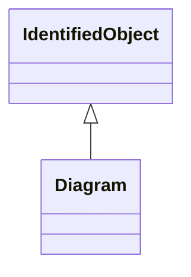

# Diagram

The diagram being exchanged. The coordinate system is a standard Cartesian coordinate system and the orientation attribute defines the orientation. The initial view related attributes can be used to specify an initial view with the x,y coordinates of the diagonal points.

## Inheritance

<button class="mermaid-enlarge-button">Enlarge Diagram</button>

## Attributes

| Label | Type | Multiplicity | Comment |
|-------|------|--------------|---------|
| DiagramElements | [DiagramObject](DiagramObject.md) | 0..n | A diagram is made up of multiple diagram objects. |
| DiagramStyle | [DiagramStyle](DiagramStyle.md) | 0..1 | A Diagram may have a DiagramStyle. |
| orientation | [OrientationKind](OrientationKind.md) | 1..1 | Coordinate system orientation of the diagram. A positive orientation gives standard “right-hand” orientation, with negative orientation indicating a “left-hand” orientation. For 2D diagrams, a positive orientation will result in X values increasing from left to right and Y values increasing from bottom to top. A negative orientation gives the “left-hand” orientation (favoured by computer graphics displays) with X values increasing from left to right and Y values increasing from top to bottom. |
| x1InitialView | Float | 0..1 | X coordinate of the first corner of the initial view. |
| x2InitialView | Float | 0..1 | X coordinate of the second corner of the initial view. |
| y1InitialView | Float | 0..1 | Y coordinate of the first corner of the initial view. |
| y2InitialView | Float | 0..1 | Y coordinate of the second corner of the initial view. |

