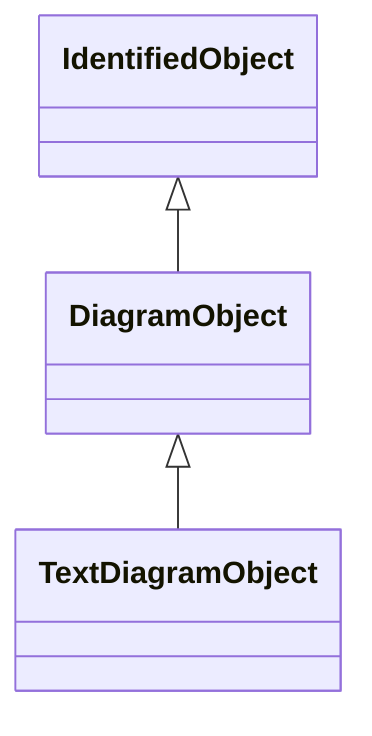

# DiagramObject

An object that defines one or more points in a given space. This object can be associated with anything that specializes IdentifiedObject. For single line diagrams such objects typically include such items as analog values, breakers, disconnectors, power transformers, and transmission lines.

## Inheritance

<button class="mermaid-enlarge-button">Enlarge Diagram</button>

## Attributes

| Label | Type | Multiplicity | Comment |
|-------|------|--------------|---------|
| Diagram | [Diagram](Diagram.md) | 1 | A diagram object is part of a diagram. |
| DiagramObjectPoints | [DiagramObjectPoint](DiagramObjectPoint.md) | 0..n | A diagram object can have 0 or more points to reflect its layout position, routing (for polylines) or boundary (for polygons). |
| DiagramObjectStyle | [DiagramObjectStyle](DiagramObjectStyle.md) | 0..1 | A diagram object has a style associated that provides a reference for the style used in the originating system. |
| IdentifiedObject_ | [IdentifiedObject](IdentifiedObject.md) | 0..1 | The domain object to which this diagram object is associated. |
| VisibilityLayers | [VisibilityLayer](VisibilityLayer.md) | 0..n | A diagram object can be part of multiple visibility layers. |
| drawingOrder | Integer | 0..1 | The drawing order of this element. The higher the number, the later the element is drawn in sequence. This is used to ensure that elements that overlap are rendered in the correct order. |
| isPolygon | Boolean | 0..1 | Defines whether or not the diagram objects points define the boundaries of a polygon or the routing of a polyline. If this value is true then a receiving application should consider the first and last points to be connected. |
| offsetX | Float | 0..1 | The offset in the X direction. This is used for defining the offset from centre for rendering an icon (the default is that a single point specifies the centre of the icon). The offset is in per-unit with 0 indicating there is no offset from the horizontal centre of the icon. -0.5 indicates it is offset by 50% to the left and 0.5 indicates an offset of 50% to the right. |
| offsetY | Float | 0..1 | The offset in the Y direction. This is used for defining the offset from centre for rendering an icon (the default is that a single point specifies the centre of the icon). The offset is in per-unit with 0 indicating there is no offset from the vertical centre of the icon. The offset direction is dependent on the orientation of the diagram, with -0.5 and 0.5 indicating an offset of +/- 50% on the vertical axis. |
| rotation | Float | 0..1 | Sets the angle of rotation of the diagram object. Zero degrees is pointing to the top of the diagram. Rotation is clockwise. DiagramObject.rotation=0 has the following meaning: The connection point of an element which has one terminal is pointing to the top side of the diagram. The connection point 'From side' of an element which has more than one terminal is pointing to the top side of the diagram. DiagramObject.rotation=90 has the following meaning: The connection point of an element which has one terminal is pointing to the right hand side of the diagram. The connection point 'From side' of an element which has more than one terminal is pointing to the right hand side of the diagram. |

