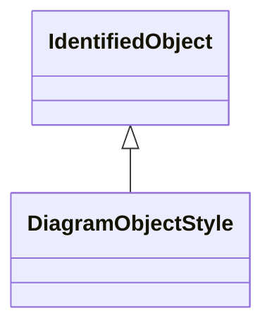

# DiagramObjectStyle

A reference to a style used by the originating system for a diagram object. A diagram object style describes information such as line thickness, shape such as circle or rectangle etc, and colour.

## Inheritance

<button class="mermaid-enlarge-button">Enlarge Diagram</button>

## Attributes

| Label | Type | Multiplicity | Comment |
|-------|------|--------------|---------|
| StyledObjects | [DiagramObject](DiagramObject.md) | 0..n | A style can be assigned to multiple diagram objects. |

