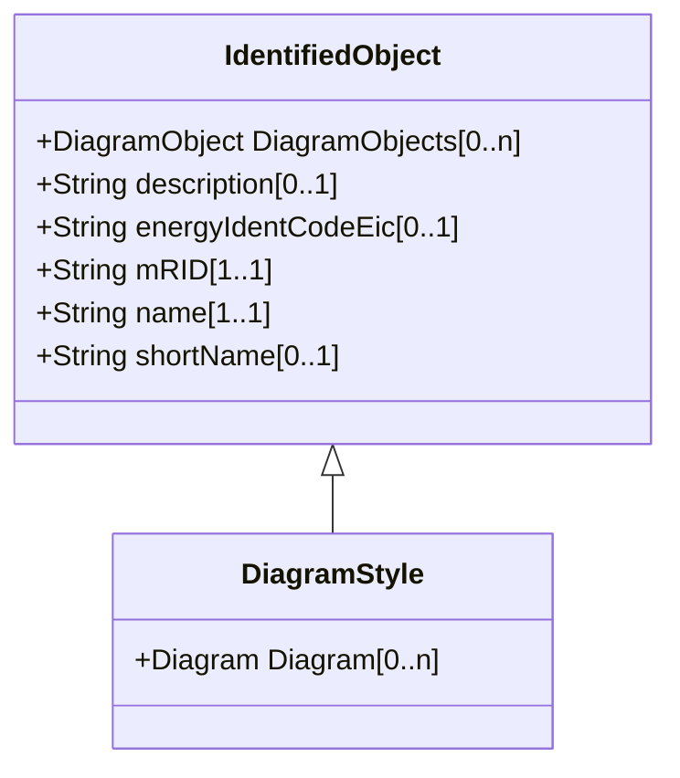

# DiagramStyle

The diagram style refers to a style used by the originating system for a diagram. A diagram style describes information such as schematic, geographic, etc.

## Inheritance

<button class="mermaid-enlarge-button">Enlarge Diagram</button>

## Attributes

| Label | Type | Multiplicity | Comment |
|-------|------|--------------|---------|
| Diagram | [Diagram](Diagram.md) | 0..n | A DiagramStyle can be used by many Diagrams. |

