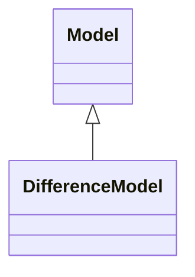

# DifferenceModel

It represents the difference model header. The content is described by the Model class, the association role forwardDifferences and association role reverseDifferences. Both association roles may have one set of Statements.

## Inheritance

<button class="mermaid-enlarge-button">Enlarge Diagram</button>

## Attributes

| Label | Type | Multiplicity | Comment |
|-------|------|--------------|---------|
| forwardDifferences | N/A | 1..n | A property of the difference model whose value is a collection of statements (i.e., resources of type rdf:Statement) representing the forward difference statements. |
| preconditions | N/A | 1..n | A property of the difference model whose value is the collection of precondition statements. |
| reverseDifferences | N/A | 1..n | A property of the difference model whose value is the collection of reverse difference statements. |

