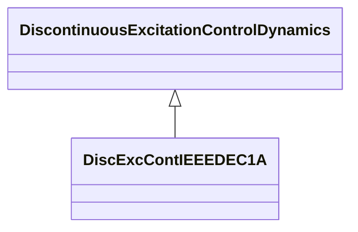

# DiscExcContIEEEDEC1A

IEEE type DEC1A discontinuous excitation control model that boosts generator excitation to a level higher than that demanded by the voltage regulator and stabilizer immediately following a system fault. Reference: IEEE 421.5-2005, 12.2.

## Inheritance

<button class="mermaid-enlarge-button">Enlarge Diagram</button>

## Attributes

| Label | Type | Multiplicity | Comment |
|-------|------|--------------|---------|
| esc | Float | 1..1 | Speed change reference (ESC). Typical value = 0,0015. |
| kan | Float | 1..1 | Discontinuous controller gain (KAN). Typical value = 400. |
| ketl | Float | 1..1 | Terminal voltage limiter gain (KETL). Typical value = 47. |
| tan | Float | 1..1 | Discontinuous controller time constant (TAN) (>= 0). Typical value = 0,08. |
| td | Float | 1..1 | Time constant (TD) (>= 0). Typical value = 0,03. |
| tl1 | Float | 1..1 | Time constant (TL1) (>= 0). Typical value = 0,025. |
| tl2 | Float | 1..1 | Time constant (TL2) (>= 0). Typical value = 1,25. |
| tw5 | Float | 1..1 | DEC washout time constant (TW5) (>= 0). Typical value = 5. |
| val | Float | 1..1 | Regulator voltage reference (VAL). Typical value = 5,5. |
| vanmax | Float | 1..1 | Limiter for Van (VANMAX). |
| vomax | Float | 1..1 | Limiter (VOMAX) (> DiscExcContIEEEDEC1A.vomin). Typical value = 0,3. |
| vomin | Float | 1..1 | Limiter (VOMIN) (< DiscExcContIEEEDEC1A.vomax). Typical value = 0,1. |
| vsmax | Float | 1..1 | Limiter (VSMAX)(> DiscExcContIEEEDEC1A.vsmin). Typical value = 0,2. |
| vsmin | Float | 1..1 | Limiter (VSMIN) (< DiscExcContIEEEDEC1A.vsmax). Typical value = -0,066. |
| vtc | Float | 1..1 | Terminal voltage level reference (VTC). Typical value = 0,95. |
| vtlmt | Float | 1..1 | Voltage reference (VTLMT). Typical value = 1,1. |
| vtm | Float | 1..1 | Voltage limits (VTM). Typical value = 1,13. |
| vtn | Float | 1..1 | Voltage limits (VTN). Typical value = 1,12. |

