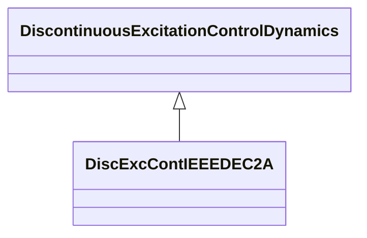

# DiscExcContIEEEDEC2A

IEEE type DEC2A model for discontinuous excitation control. This system provides transient excitation boosting via an open-loop control as initiated by a trigger signal generated remotely. Reference: IEEE 421.5-2005 12.3.

## Inheritance

<button class="mermaid-enlarge-button">Enlarge Diagram</button>

## Attributes

| Label | Type | Multiplicity | Comment |
|-------|------|--------------|---------|
| td1 | Float | 1..1 | Discontinuous controller time constant (TD1) (>= 0). |
| td2 | Float | 1..1 | Discontinuous controller washout time constant (TD2) (>= 0). |
| vdmax | Float | 1..1 | Limiter (VDMAX) (> DiscExcContIEEEDEC2A.vdmin). |
| vdmin | Float | 1..1 | Limiter (VDMIN) (< DiscExcContIEEEDEC2A.vdmax). |
| vk | Float | 1..1 | Discontinuous controller input reference (VK). |

