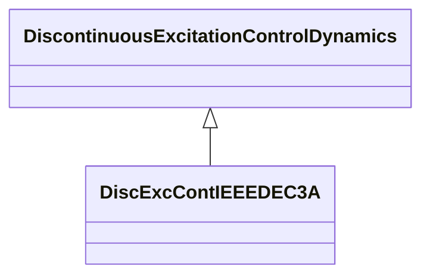

# DiscExcContIEEEDEC3A

IEEE type DEC3A model. In some systems, the stabilizer output is disconnected from the regulator immediately following a severe fault to prevent the stabilizer from competing with action of voltage regulator during the first swing. Reference: IEEE 421.5-2005 12.4.

## Inheritance

<button class="mermaid-enlarge-button">Enlarge Diagram</button>

## Attributes

| Label | Type | Multiplicity | Comment |
|-------|------|--------------|---------|
| tdr | Float | 1..1 | Reset time delay (TDR) (>= 0). |
| vtmin | Float | 1..1 | Terminal undervoltage comparison level (VTMIN). |

