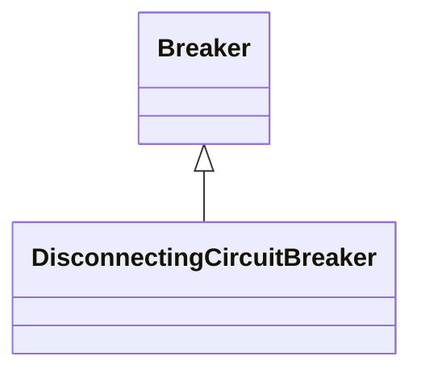

# DisconnectingCircuitBreaker

A circuit breaking device including disconnecting function, eliminating the need for separate disconnectors.

## Inheritance

<button class="mermaid-enlarge-button">Enlarge Diagram</button>

## Attributes

| Label | Type | Multiplicity | Comment |
|-------|------|--------------|---------|
| No attributes | | | |

