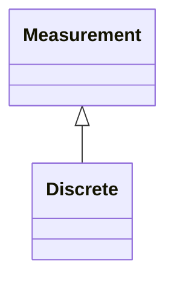

# Discrete

Discrete represents a discrete Measurement, i.e. a Measurement representing discrete values, e.g. a Breaker position.

## Inheritance

<button class="mermaid-enlarge-button">Enlarge Diagram</button>

## Attributes

| Label | Type | Multiplicity | Comment |
|-------|------|--------------|---------|
| DiscreteValues | [DiscreteValue](DiscreteValue.md) | 0..n | The values connected to this measurement. |
| ValueAliasSet | [ValueAliasSet](ValueAliasSet.md) | 0..1 | The ValueAliasSet used for translation of a MeasurementValue.value to a name. |

