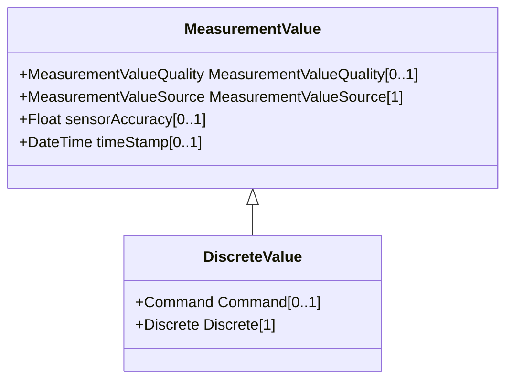

# DiscreteValue

DiscreteValue represents a discrete MeasurementValue.

## Inheritance

<button class="mermaid-enlarge-button">Enlarge Diagram</button>

## Attributes

| Label | Type | Multiplicity | Comment |
|-------|------|--------------|---------|
| Command | [Command](Command.md) | 0..1 | The Control variable associated with the MeasurementValue. |
| Discrete | [Discrete](Discrete.md) | 1 | Measurement to which this value is connected. |

