# DynamicsFunctionBlock

Abstract parent class for all Dynamics function blocks.

## Inheritance

```mermaid
classDiagram
    IdentifiedObject <|-- DynamicsFunctionBlock
    DynamicsFunctionBlock <|-- TurbineLoadControllerDynamics
    DynamicsFunctionBlock <|-- WindTurbineType3or4Dynamics
    DynamicsFunctionBlock <|-- MechanicalLoadDynamics
    DynamicsFunctionBlock <|-- ExcitationSystemDynamics
    DynamicsFunctionBlock <|-- VoltageCompensatorDynamics
    DynamicsFunctionBlock <|-- DiscontinuousExcitationControlDynamics
    DynamicsFunctionBlock <|-- UnderexcitationLimiterDynamics
    DynamicsFunctionBlock <|-- OverexcitationLimiterDynamics
    DynamicsFunctionBlock <|-- PFVArControllerType2Dynamics
    DynamicsFunctionBlock <|-- TurbineGovernorDynamics
    DynamicsFunctionBlock <|-- HVDCDynamics
    DynamicsFunctionBlock <|-- PFVArControllerType1Dynamics
    DynamicsFunctionBlock <|-- StaticVarCompensatorDynamics
    DynamicsFunctionBlock <|-- PowerSystemStabilizerDynamics
    DynamicsFunctionBlock <|-- WindPlantDynamics
    DynamicsFunctionBlock <|-- RotatingMachineDynamics
    DynamicsFunctionBlock <|-- CrossCompoundTurbineGovernorDynamics
    DynamicsFunctionBlock <|-- VoltageAdjusterDynamics
    DynamicsFunctionBlock <|-- WindTurbineType1or2Dynamics
```

<button class="mermaid-enlarge-button">Enlarge Diagram</button>

## Attributes

| Label | Type | Multiplicity | Comment |
|-------|------|--------------|---------|
| enabled | Boolean | 1..1 | Function block used indicator. true = use of function block is enabled false = use of function block is disabled. |

