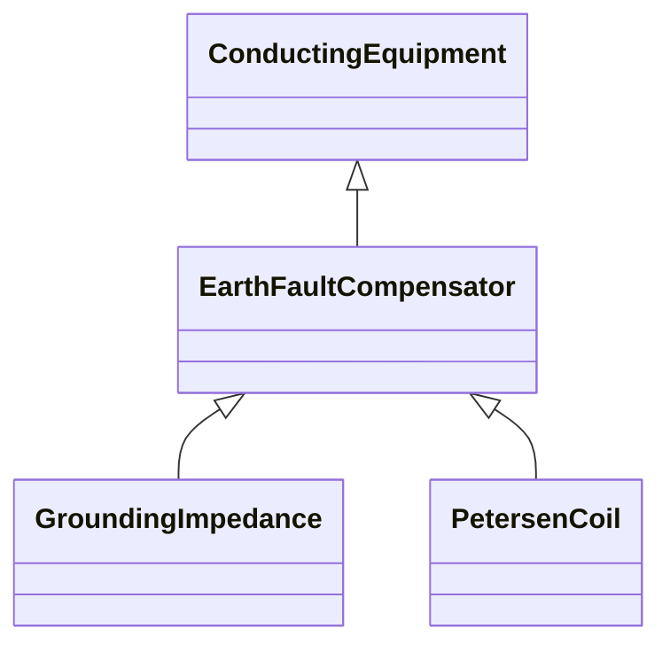

# EarthFaultCompensator

A conducting equipment used to represent a connection to ground which is typically used to compensate earth faults. An earth fault compensator device modelled with a single terminal implies a second terminal solidly connected to ground. If two terminals are modelled, the ground is not assumed and normal connection rules apply.

## Inheritance

<button class="mermaid-enlarge-button">Enlarge Diagram</button>

## Attributes

| Label | Type | Multiplicity | Comment |
|-------|------|--------------|---------|
| r | Float | 0..1 | Nominal resistance of device. |

