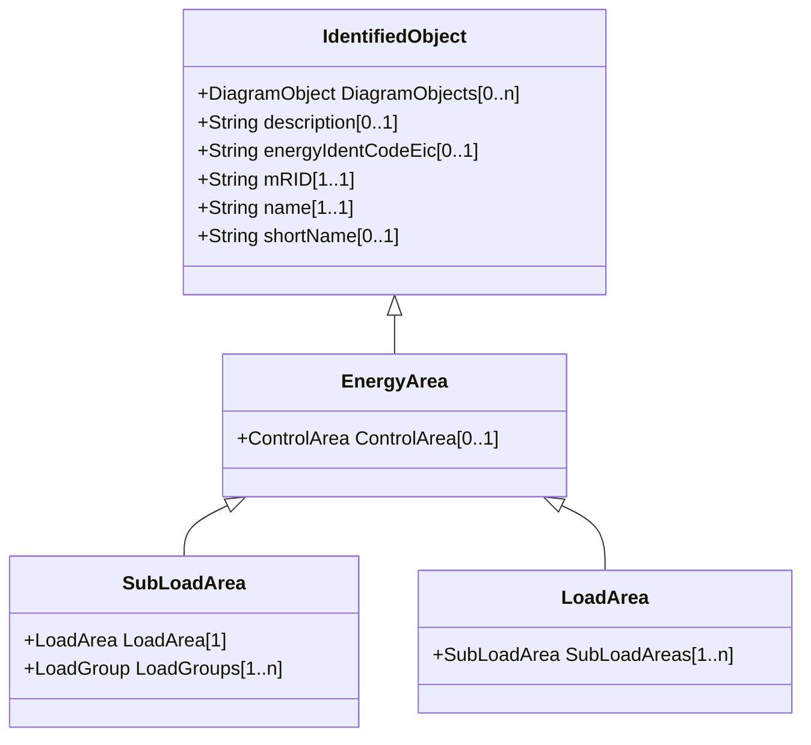

# EnergyArea

Describes an area having energy production or consumption. Specializations are intended to support the load allocation function as typically required in energy management systems or planning studies to allocate hypothesized load levels to individual load points for power flow analysis. Often the energy area can be linked to both measured and forecast load levels.

## Inheritance

<button class="mermaid-enlarge-button">Enlarge Diagram</button>

## Attributes

| Label | Type | Multiplicity | Comment |
|-------|------|--------------|---------|
| ControlArea | [ControlArea](ControlArea.md) | 0..1 | The control area specification that is used for the load forecast. |

