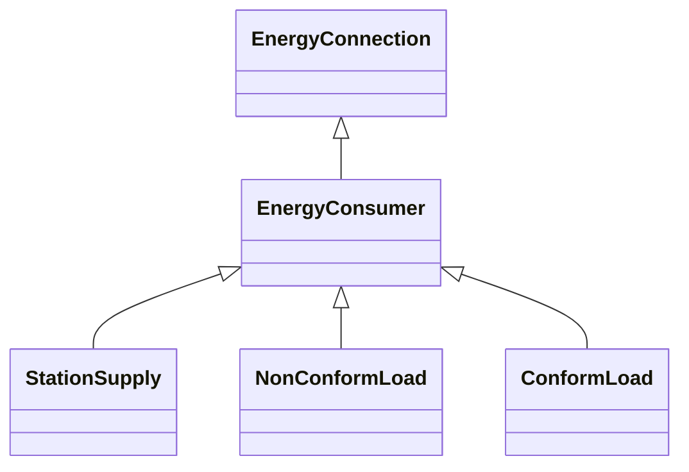

# EnergyConsumer

Generic user of energy - a point of consumption on the power system model. EnergyConsumer.pfixed, .qfixed, .pfixedPct and .qfixedPct have meaning only if there is no LoadResponseCharacteristic associated with EnergyConsumer or if LoadResponseCharacteristic.exponentModel is set to False.

## Inheritance

<button class="mermaid-enlarge-button">Enlarge Diagram</button>

## Attributes

| Label | Type | Multiplicity | Comment |
|-------|------|--------------|---------|
| LoadDynamics | [LoadDynamics](LoadDynamics.md) | 0..1 | Load dynamics model used to describe dynamic behaviour of this energy consumer. |
| LoadResponse | [LoadResponseCharacteristic](LoadResponseCharacteristic.md) | 0..1 | The load response characteristic of this load. If missing, this load is assumed to be constant power. |
| p | Float | 1..1 | Active power of the load. Load sign convention is used, i.e. positive sign means flow out from a node. For voltage dependent loads the value is at rated voltage. Starting value for a steady state solution. |
| pfixed | Float | 0..1 | Active power of the load that is a fixed quantity and does not vary as load group value varies. Load sign convention is used, i.e. positive sign means flow out from a node. |
| pfixedPct | Float | 0..1 | Fixed active power as a percentage of load group fixed active power. Used to represent the time-varying components. Load sign convention is used, i.e. positive sign means flow out from a node. |
| q | Float | 1..1 | Reactive power of the load. Load sign convention is used, i.e. positive sign means flow out from a node. For voltage dependent loads the value is at rated voltage. Starting value for a steady state solution. |
| qfixed | Float | 0..1 | Reactive power of the load that is a fixed quantity and does not vary as load group value varies. Load sign convention is used, i.e. positive sign means flow out from a node. |
| qfixedPct | Float | 0..1 | Fixed reactive power as a percentage of load group fixed reactive power. Used to represent the time-varying components. Load sign convention is used, i.e. positive sign means flow out from a node. |

