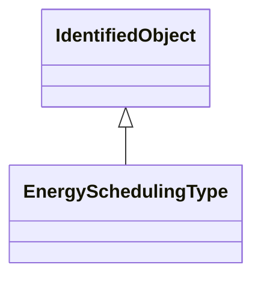

# EnergySchedulingType

Used to define the type of generation for scheduling purposes.

## Inheritance

<button class="mermaid-enlarge-button">Enlarge Diagram</button>

## Attributes

| Label | Type | Multiplicity | Comment |
|-------|------|--------------|---------|
| EnergySource | [EnergySource](EnergySource.md) | 0..n | Energy Source of a particular Energy Scheduling Type. |

