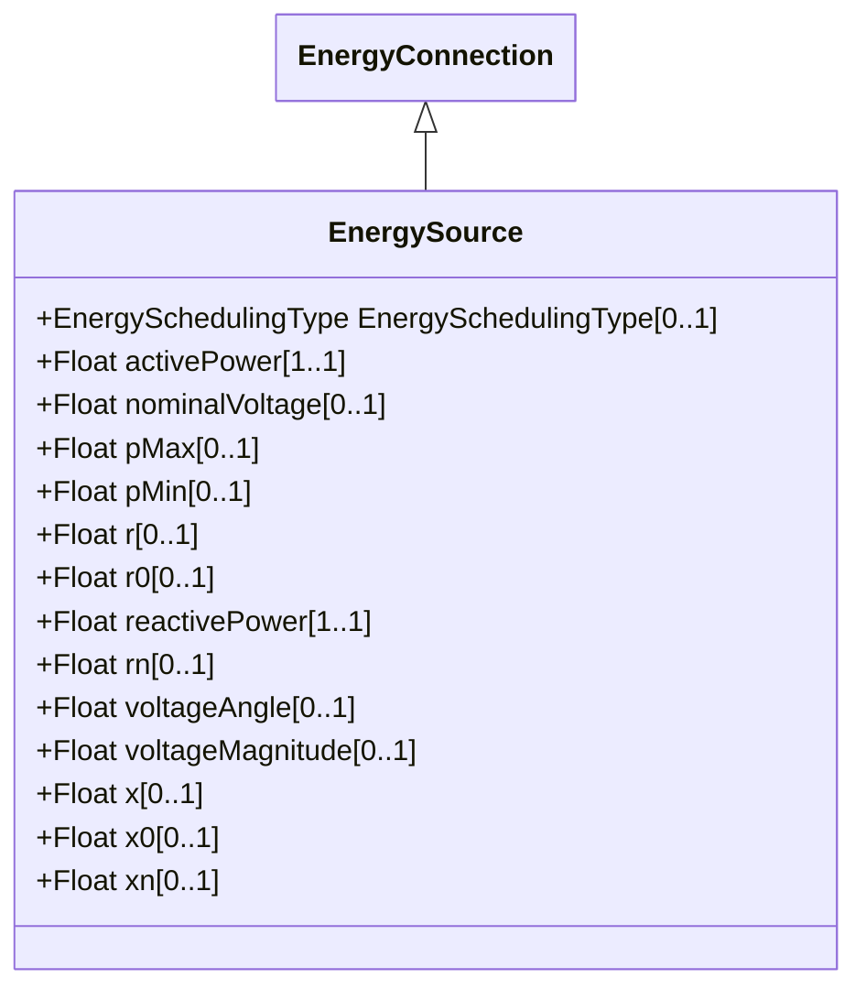

# EnergySource

A generic equivalent for an energy supplier on a transmission or distribution voltage level.

## Inheritance

<button class="mermaid-enlarge-button">Enlarge Diagram</button>

## Attributes

| Label | Type | Multiplicity | Comment |
|-------|------|--------------|---------|
| EnergySchedulingType | [EnergySchedulingType](EnergySchedulingType.md) | 0..1 | Energy Scheduling Type of an Energy Source. |
| activePower | Float | 1..1 | High voltage source active injection. Load sign convention is used, i.e. positive sign means flow out from a node. Starting value for steady state solutions. |
| nominalVoltage | Float | 0..1 | Phase-to-phase nominal voltage. |
| pMax | Float | 0..1 | This is the maximum active power that can be produced by the source. Load sign convention is used, i.e. positive sign means flow out from a TopologicalNode (bus) into the conducting equipment. |
| pMin | Float | 0..1 | This is the minimum active power that can be produced by the source. Load sign convention is used, i.e. positive sign means flow out from a TopologicalNode (bus) into the conducting equipment. |
| r | Float | 0..1 | Positive sequence Thevenin resistance. |
| r0 | Float | 0..1 | Zero sequence Thevenin resistance. |
| reactivePower | Float | 1..1 | High voltage source reactive injection. Load sign convention is used, i.e. positive sign means flow out from a node. Starting value for steady state solutions. |
| rn | Float | 0..1 | Negative sequence Thevenin resistance. |
| voltageAngle | Float | 0..1 | Phase angle of a-phase open circuit used when voltage characteristics need to be imposed at the node associated with the terminal of the energy source, such as when voltages and angles from the transmission level are used as input to the distribution network. The attribute shall be a positive value or zero. |
| voltageMagnitude | Float | 0..1 | Phase-to-phase open circuit voltage magnitude used when voltage characteristics need to be imposed at the node associated with the terminal of the energy source, such as when voltages and angles from the transmission level are used as input to the distribution network. The attribute shall be a positive value or zero. |
| x | Float | 0..1 | Positive sequence Thevenin reactance. |
| x0 | Float | 0..1 | Zero sequence Thevenin reactance. |
| xn | Float | 0..1 | Negative sequence Thevenin reactance. |

