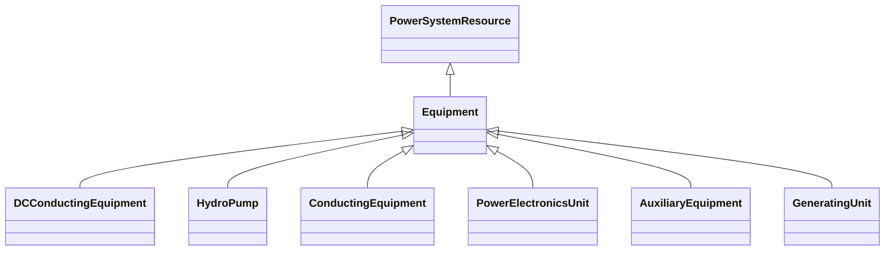

# Equipment

The parts of a power system that are physical devices, electronic or mechanical.

## Inheritance

<button class="mermaid-enlarge-button">Enlarge Diagram</button>

## Attributes

| Label | Type | Multiplicity | Comment |
|-------|------|--------------|---------|
| EquipmentContainer | [EquipmentContainer](EquipmentContainer.md) | 0..1 | Container of this equipment. |
| OperationalLimitSet | [OperationalLimitSet](OperationalLimitSet.md) | 0..n | The operational limit sets associated with this equipment. |
| aggregate | Boolean | 0..1 | The aggregate flag provides an alternative way of representing an aggregated (equivalent) element. It is applicable in cases when the dedicated classes for equivalent equipment do not have all of the attributes necessary to represent the required level of detail. In case the flag is set to “true” the single instance of equipment represents multiple pieces of equipment that have been modelled together as an aggregate equivalent obtained by a network reduction procedure. Examples would be power transformers or synchronous machines operating in parallel modelled as a single aggregate power transformer or aggregate synchronous machine. The attribute is not used for EquivalentBranch, EquivalentShunt and EquivalentInjection. |
| inService | Boolean | 1..1 | Specifies the availability of the equipment. True means the equipment is available for topology processing, which determines if the equipment is energized or not. False means that the equipment is treated by network applications as if it is not in the model. |
| normallyInService | Boolean | 0..1 | Specifies the availability of the equipment under normal operating conditions. True means the equipment is available for topology processing, which determines if the equipment is energized or not. False means that the equipment is treated by network applications as if it is not in the model. |

