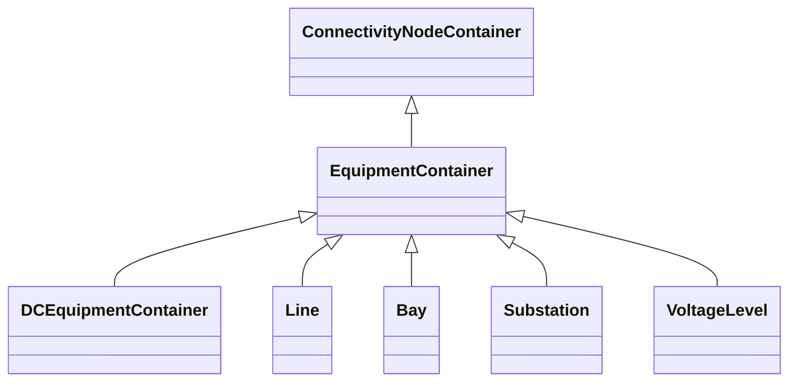

# EquipmentContainer

A modelling construct to provide a root class for containing equipment.

## Inheritance

<button class="mermaid-enlarge-button">Enlarge Diagram</button>

## Attributes

| Label | Type | Multiplicity | Comment |
|-------|------|--------------|---------|
| Equipments | [Equipment](Equipment.md) | 0..n | Contained equipment. |

