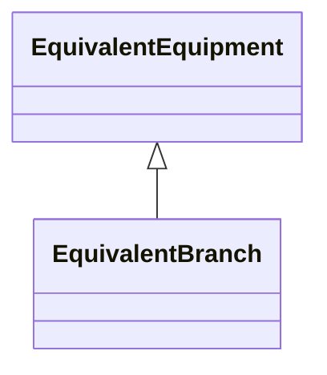

# EquivalentBranch

The class represents equivalent branches. In cases where a transformer phase shift is modelled and the EquivalentBranch is spanning the same nodes, the impedance quantities for the EquivalentBranch shall consider the needed phase shift.

## Inheritance

<button class="mermaid-enlarge-button">Enlarge Diagram</button>

## Attributes

| Label | Type | Multiplicity | Comment |
|-------|------|--------------|---------|
| negativeR12 | Float | 1..1 | Negative sequence series resistance from terminal sequence 1 to terminal sequence 2. Used for short circuit data exchange according to IEC 60909. EquivalentBranch is a result of network reduction prior to the data exchange. |
| negativeR21 | Float | 1..1 | Negative sequence series resistance from terminal sequence 2 to terminal sequence 1. Used for short circuit data exchange according to IEC 60909. EquivalentBranch is a result of network reduction prior to the data exchange. |
| negativeX12 | Float | 1..1 | Negative sequence series reactance from terminal sequence 1 to terminal sequence 2. Used for short circuit data exchange according to IEC 60909. Usage : EquivalentBranch is a result of network reduction prior to the data exchange. |
| negativeX21 | Float | 1..1 | Negative sequence series reactance from terminal sequence 2 to terminal sequence 1. Used for short circuit data exchange according to IEC 60909. Usage: EquivalentBranch is a result of network reduction prior to the data exchange. |
| positiveR12 | Float | 1..1 | Positive sequence series resistance from terminal sequence 1 to terminal sequence 2 . Used for short circuit data exchange according to IEC 60909. EquivalentBranch is a result of network reduction prior to the data exchange. |
| positiveR21 | Float | 1..1 | Positive sequence series resistance from terminal sequence 2 to terminal sequence 1. Used for short circuit data exchange according to IEC 60909. EquivalentBranch is a result of network reduction prior to the data exchange. |
| positiveX12 | Float | 1..1 | Positive sequence series reactance from terminal sequence 1 to terminal sequence 2. Used for short circuit data exchange according to IEC 60909. Usage : EquivalentBranch is a result of network reduction prior to the data exchange. |
| positiveX21 | Float | 1..1 | Positive sequence series reactance from terminal sequence 2 to terminal sequence 1. Used for short circuit data exchange according to IEC 60909. Usage : EquivalentBranch is a result of network reduction prior to the data exchange. |
| r | Float | 1..1 | Positive sequence series resistance of the reduced branch. |
| r21 | Float | 0..1 | Resistance from terminal sequence 2 to terminal sequence 1 .Used for steady state power flow. This attribute is optional and represent unbalanced network such as off-nominal phase shifter. If only EquivalentBranch.r is given, then EquivalentBranch.r21 is assumed equal to EquivalentBranch.r. Usage rule : EquivalentBranch is a result of network reduction prior to the data exchange. |
| x | Float | 1..1 | Positive sequence series reactance of the reduced branch. |
| x21 | Float | 0..1 | Reactance from terminal sequence 2 to terminal sequence 1. Used for steady state power flow. This attribute is optional and represents an unbalanced network such as off-nominal phase shifter. If only EquivalentBranch.x is given, then EquivalentBranch.x21 is assumed equal to EquivalentBranch.x. Usage rule: EquivalentBranch is a result of network reduction prior to the data exchange. |
| zeroR12 | Float | 1..1 | Zero sequence series resistance from terminal sequence 1 to terminal sequence 2. Used for short circuit data exchange according to IEC 60909. EquivalentBranch is a result of network reduction prior to the data exchange. |
| zeroR21 | Float | 1..1 | Zero sequence series resistance from terminal sequence 2 to terminal sequence 1. Used for short circuit data exchange according to IEC 60909. Usage : EquivalentBranch is a result of network reduction prior to the data exchange. |
| zeroX12 | Float | 1..1 | Zero sequence series reactance from terminal sequence 1 to terminal sequence 2. Used for short circuit data exchange according to IEC 60909. Usage : EquivalentBranch is a result of network reduction prior to the data exchange. |
| zeroX21 | Float | 1..1 | Zero sequence series reactance from terminal sequence 2 to terminal sequence 1. Used for short circuit data exchange according to IEC 60909. Usage : EquivalentBranch is a result of network reduction prior to the data exchange. |

