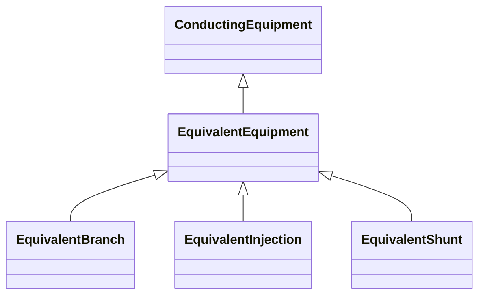

# EquivalentEquipment

The class represents equivalent objects that are the result of a network reduction. The class is the base for equivalent objects of different types.

## Inheritance

<button class="mermaid-enlarge-button">Enlarge Diagram</button>

## Attributes

| Label | Type | Multiplicity | Comment |
|-------|------|--------------|---------|
| EquivalentNetwork | [EquivalentNetwork](EquivalentNetwork.md) | 0..1 | The equivalent where the reduced model belongs. |

