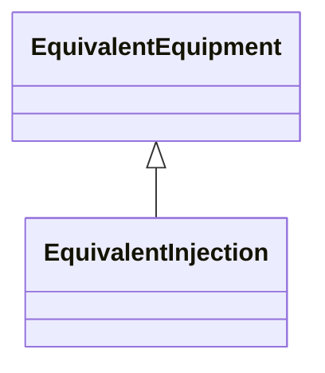

# EquivalentInjection

This class represents equivalent injections (generation or load). Voltage regulation is allowed only at the point of connection.

## Inheritance

<button class="mermaid-enlarge-button">Enlarge Diagram</button>

## Attributes

| Label | Type | Multiplicity | Comment |
|-------|------|--------------|---------|
| ReactiveCapabilityCurve | [ReactiveCapabilityCurve](ReactiveCapabilityCurve.md) | 0..1 | The reactive capability curve used by this equivalent injection. |
| maxP | Float | 0..1 | Maximum active power of the injection. |
| maxQ | Float | 0..1 | Maximum reactive power of the injection. Used for modelling of infeed for load flow exchange. Not used for short circuit modelling. If maxQ and minQ are not used ReactiveCapabilityCurve can be used. |
| minP | Float | 0..1 | Minimum active power of the injection. |
| minQ | Float | 0..1 | Minimum reactive power of the injection. Used for modelling of infeed for load flow exchange. Not used for short circuit modelling. If maxQ and minQ are not used ReactiveCapabilityCurve can be used. |
| p | Float | 1..1 | Equivalent active power injection. Load sign convention is used, i.e. positive sign means flow out from a node. Starting value for steady state solutions. |
| q | Float | 1..1 | Equivalent reactive power injection. Load sign convention is used, i.e. positive sign means flow out from a node. Starting value for steady state solutions. |
| r | Float | 1..1 | Positive sequence resistance. Used to represent Extended-Ward (IEC 60909). Usage : Extended-Ward is a result of network reduction prior to the data exchange. |
| r0 | Float | 1..1 | Zero sequence resistance. Used to represent Extended-Ward (IEC 60909). Usage : Extended-Ward is a result of network reduction prior to the data exchange. |
| r2 | Float | 1..1 | Negative sequence resistance. Used to represent Extended-Ward (IEC 60909). Usage : Extended-Ward is a result of network reduction prior to the data exchange. |
| regulationCapability | Boolean | 1..1 | Specifies whether or not the EquivalentInjection has the capability to regulate the local voltage. If true the EquivalentInjection can regulate. If false the EquivalentInjection cannot regulate. ReactiveCapabilityCurve can only be associated with EquivalentInjection if the flag is true. |
| regulationStatus | Boolean | 0..1 | Specifies the regulation status of the EquivalentInjection. True is regulating. False is not regulating. |
| regulationTarget | Float | 0..1 | The target voltage for voltage regulation. The attribute shall be a positive value. |
| x | Float | 1..1 | Positive sequence reactance. Used to represent Extended-Ward (IEC 60909). Usage : Extended-Ward is a result of network reduction prior to the data exchange. |
| x0 | Float | 1..1 | Zero sequence reactance. Used to represent Extended-Ward (IEC 60909). Usage : Extended-Ward is a result of network reduction prior to the data exchange. |
| x2 | Float | 1..1 | Negative sequence reactance. Used to represent Extended-Ward (IEC 60909). Usage : Extended-Ward is a result of network reduction prior to the data exchange. |

