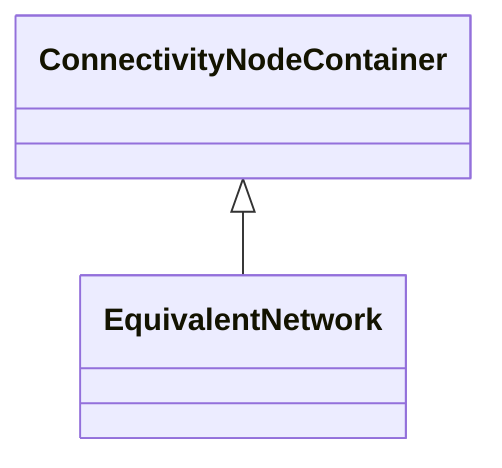

# EquivalentNetwork

A class that groups electrical equivalents, including internal nodes, of a network that has been reduced. The ConnectivityNodes contained in the equivalent are intended to reflect internal nodes of the equivalent. The boundary Connectivity nodes where the equivalent connects outside itself are not contained by the equivalent.

## Inheritance

<button class="mermaid-enlarge-button">Enlarge Diagram</button>

## Attributes

| Label | Type | Multiplicity | Comment |
|-------|------|--------------|---------|
| EquivalentEquipments | [EquivalentEquipment](EquivalentEquipment.md) | 0..n | The associated reduced equivalents. |

