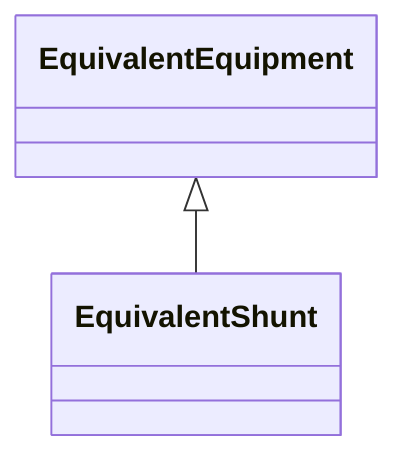

# EquivalentShunt

The class represents equivalent shunts.

## Inheritance

<button class="mermaid-enlarge-button">Enlarge Diagram</button>

## Attributes

| Label | Type | Multiplicity | Comment |
|-------|------|--------------|---------|
| b | Float | 1..1 | Positive sequence shunt susceptance. |
| g | Float | 1..1 | Positive sequence shunt conductance. |

