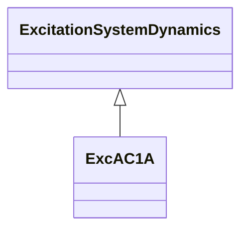

# ExcAC1A

Modified IEEE AC1A alternator-supplied rectifier excitation system with different rate feedback source.

## Inheritance

<button class="mermaid-enlarge-button">Enlarge Diagram</button>

## Attributes

| Label | Type | Multiplicity | Comment |
|-------|------|--------------|---------|
| hvlvgates | Boolean | 1..1 | Indicates if both HV gate and LV gate are active (HVLVgates). true = gates are used false = gates are not used. Typical value = true. |
| ka | Float | 1..1 | Voltage regulator gain (Ka) (> 0). Typical value = 400. |
| kc | Float | 1..1 | Rectifier loading factor proportional to commutating reactance (Kc) (>= 0). Typical value = 0,2. |
| kd | Float | 1..1 | Demagnetizing factor, a function of exciter alternator reactances (Kd) (>= 0). Typical value = 0,38. |
| ke | Float | 1..1 | Exciter constant related to self-excited field (Ke). Typical value = 1. |
| kf | Float | 1..1 | Excitation control system stabilizer gains (Kf) (>= 0). Typical value = 0,03. |
| kf1 | Float | 1..1 | Coefficient to allow different usage of the model (Kf1) (>= 0). Typical value = 0. |
| kf2 | Float | 1..1 | Coefficient to allow different usage of the model (Kf2) (>= 0). Typical value = 1. |
| ks | Float | 1..1 | Coefficient to allow different usage of the model-speed coefficient (Ks) (>= 0). Typical value = 0. |
| seve1 | Float | 1..1 | Exciter saturation function value at the corresponding exciter voltage, Ve1, back of commutating reactance (Se[Ve1]) (>= 0). Typical value = 0,1. |
| seve2 | Float | 1..1 | Exciter saturation function value at the corresponding exciter voltage, Ve2, back of commutating reactance (Se[Ve2]) (>= 0). Typical value = 0,03. |
| ta | Float | 1..1 | Voltage regulator time constant (Ta) (> 0). Typical value = 0,02. |
| tb | Float | 1..1 | Voltage regulator time constant (Tb) (>= 0). Typical value = 0. |
| tc | Float | 1..1 | Voltage regulator time constant (Tc) (>= 0). Typical value = 0. |
| te | Float | 1..1 | Exciter time constant, integration rate associated with exciter control (Te) (> 0). Typical value = 0,8. |
| tf | Float | 1..1 | Excitation control system stabilizer time constant (Tf) (> 0). Typical value = 1. |
| vamax | Float | 1..1 | Maximum voltage regulator output (Vamax) (> 0). Typical value = 14,5. |
| vamin | Float | 1..1 | Minimum voltage regulator output (Vamin) (< 0). Typical value = -14,5. |
| ve1 | Float | 1..1 | Exciter alternator output voltages back of commutating reactance at which saturation is defined (Ve1) (> 0). Typical value = 4,18. |
| ve2 | Float | 1..1 | Exciter alternator output voltages back of commutating reactance at which saturation is defined (Ve2) (> 0). Typical value = 3,14. |
| vrmax | Float | 1..1 | Maximum voltage regulator outputs (Vrmax) (> 0). Typical value = 6,03. |
| vrmin | Float | 1..1 | Minimum voltage regulator outputs (Vrmin) (< 0). Typical value = -5,43. |

