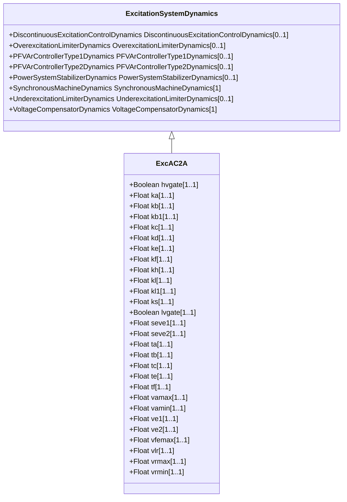

# ExcAC2A

Modified IEEE AC2A alternator-supplied rectifier excitation system with different field current limit.

## Inheritance

<button class="mermaid-enlarge-button">Enlarge Diagram</button>

## Attributes

| Label | Type | Multiplicity | Comment |
|-------|------|--------------|---------|
| hvgate | Boolean | 1..1 | Indicates if HV gate is active (HVgate). true = gate is used false = gate is not used. Typical value = true. |
| ka | Float | 1..1 | Voltage regulator gain (Ka) (> 0). Typical value = 400. |
| kb | Float | 1..1 | Second stage regulator gain (Kb) (> 0). Exciter field current controller gain. Typical value = 25. |
| kb1 | Float | 1..1 | Second stage regulator gain (Kb1). It is exciter field current controller gain used as alternative to Kb to represent a variant of the ExcAC2A model. Typical value = 25. |
| kc | Float | 1..1 | Rectifier loading factor proportional to commutating reactance (Kc) (>= 0). Typical value = 0,28. |
| kd | Float | 1..1 | Demagnetizing factor, a function of exciter alternator reactances (Kd) (>= 0). Typical value = 0,35. |
| ke | Float | 1..1 | Exciter constant related to self-excited field (Ke). Typical value = 1. |
| kf | Float | 1..1 | Excitation control system stabilizer gains (Kf) (>= 0). Typical value = 0,03. |
| kh | Float | 1..1 | Exciter field current feedback gain (Kh) (>= 0). Typical value = 1. |
| kl | Float | 1..1 | Exciter field current limiter gain (Kl). Typical value = 10. |
| kl1 | Float | 1..1 | Coefficient to allow different usage of the model (Kl1). Typical value = 1. |
| ks | Float | 1..1 | Coefficient to allow different usage of the model-speed coefficient (Ks) (>= 0). Typical value = 0. |
| lvgate | Boolean | 1..1 | Indicates if LV gate is active (LVgate). true = gate is used false = gate is not used. Typical value = true. |
| seve1 | Float | 1..1 | Exciter saturation function value at the corresponding exciter voltage, Ve1, back of commutating reactance (Se[Ve1]) (>= 0). Typical value = 0,037. |
| seve2 | Float | 1..1 | Exciter saturation function value at the corresponding exciter voltage, Ve2, back of commutating reactance (Se[Ve2]) (>= 0). Typical value = 0,012. |
| ta | Float | 1..1 | Voltage regulator time constant (Ta) (> 0). Typical value = 0,02. |
| tb | Float | 1..1 | Voltage regulator time constant (Tb) (>= 0). Typical value = 0. |
| tc | Float | 1..1 | Voltage regulator time constant (Tc) (>= 0). Typical value = 0. |
| te | Float | 1..1 | Exciter time constant, integration rate associated with exciter control (Te) (> 0). Typical value = 0,6. |
| tf | Float | 1..1 | Excitation control system stabilizer time constant (Tf) (> 0). Typical value = 1. |
| vamax | Float | 1..1 | Maximum voltage regulator output (Vamax) (> 0). Typical value = 8. |
| vamin | Float | 1..1 | Minimum voltage regulator output (Vamin) (< 0). Typical value = -8. |
| ve1 | Float | 1..1 | Exciter alternator output voltages back of commutating reactance at which saturation is defined (Ve1) (> 0). Typical value = 4,4. |
| ve2 | Float | 1..1 | Exciter alternator output voltages back of commutating reactance at which saturation is defined (Ve2) (> 0). Typical value = 3,3. |
| vfemax | Float | 1..1 | Exciter field current limit reference (Vfemax) (>= 0). Typical value = 4,4. |
| vlr | Float | 1..1 | Maximum exciter field current (Vlr) (> 0). Typical value = 4,4. |
| vrmax | Float | 1..1 | Maximum voltage regulator outputs (Vrmax) (> 0). Typical value = 105. |
| vrmin | Float | 1..1 | Minimum voltage regulator outputs (Vrmin) (< 0). Typical value = -95. |

