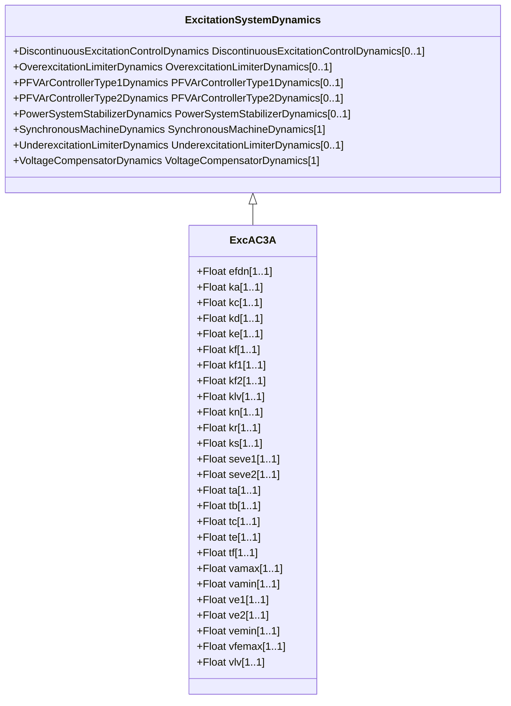

# ExcAC3A

Modified IEEE AC3A alternator-supplied rectifier excitation system with different field current limit.

## Inheritance

<button class="mermaid-enlarge-button">Enlarge Diagram</button>

## Attributes

| Label | Type | Multiplicity | Comment |
|-------|------|--------------|---------|
| efdn | Float | 1..1 | Value of Efd at which feedback gain changes (Efdn) (> 0). Typical value = 2,36. |
| ka | Float | 1..1 | Voltage regulator gain (Ka) (> 0). Typical value = 45,62. |
| kc | Float | 1..1 | Rectifier loading factor proportional to commutating reactance (Kc) (>= 0). Typical value = 0,104. |
| kd | Float | 1..1 | Demagnetizing factor, a function of exciter alternator reactances (Kd) (>= 0). Typical value = 0,499. |
| ke | Float | 1..1 | Exciter constant related to self-excited field (Ke). Typical value = 1. |
| kf | Float | 1..1 | Excitation control system stabilizer gains (Kf) (>= 0). Typical value = 0,143. |
| kf1 | Float | 1..1 | Coefficient to allow different usage of the model (Kf1). Typical value = 1. |
| kf2 | Float | 1..1 | Coefficient to allow different usage of the model (Kf2). Typical value = 0. |
| klv | Float | 1..1 | Gain used in the minimum field voltage limiter loop (Klv). Typical value = 0,194. |
| kn | Float | 1..1 | Excitation control system stabilizer gain (Kn) (>= 0). Typical value =0,05. |
| kr | Float | 1..1 | Constant associated with regulator and alternator field power supply (Kr) (> 0). Typical value =3,77. |
| ks | Float | 1..1 | Coefficient to allow different usage of the model-speed coefficient (Ks). Typical value = 0. |
| seve1 | Float | 1..1 | Exciter saturation function value at the corresponding exciter voltage, Ve1, back of commutating reactance (Se[Ve1]) (>= 0). Typical value = 1,143. |
| seve2 | Float | 1..1 | Exciter saturation function value at the corresponding exciter voltage, Ve2, back of commutating reactance (Se[Ve2]) (>= 0). Typical value = 0,1. |
| ta | Float | 1..1 | Voltage regulator time constant (Ta) (> 0). Typical value = 0,013. |
| tb | Float | 1..1 | Voltage regulator time constant (Tb) (>= 0). Typical value = 0. |
| tc | Float | 1..1 | Voltage regulator time constant (Tc) (>= 0). Typical value = 0. |
| te | Float | 1..1 | Exciter time constant, integration rate associated with exciter control (Te) (> 0). Typical value = 1,17. |
| tf | Float | 1..1 | Excitation control system stabilizer time constant (Tf) (> 0). Typical value = 1. |
| vamax | Float | 1..1 | Maximum voltage regulator output (Vamax) (> 0). Typical value = 1. |
| vamin | Float | 1..1 | Minimum voltage regulator output (Vamin) (< 0). Typical value = -0,95. |
| ve1 | Float | 1..1 | Exciter alternator output voltages back of commutating reactance at which saturation is defined (Ve1) (> 0). Typical value = 6.24. |
| ve2 | Float | 1..1 | Exciter alternator output voltages back of commutating reactance at which saturation is defined (Ve2) (> 0). Typical value = 4,68. |
| vemin | Float | 1..1 | Minimum exciter voltage output (Vemin) (<= 0). Typical value = 0. |
| vfemax | Float | 1..1 | Exciter field current limit reference (Vfemax) (>= 0). Typical value = 16. |
| vlv | Float | 1..1 | Field voltage used in the minimum field voltage limiter loop (Vlv). Typical value = 0,79. |

