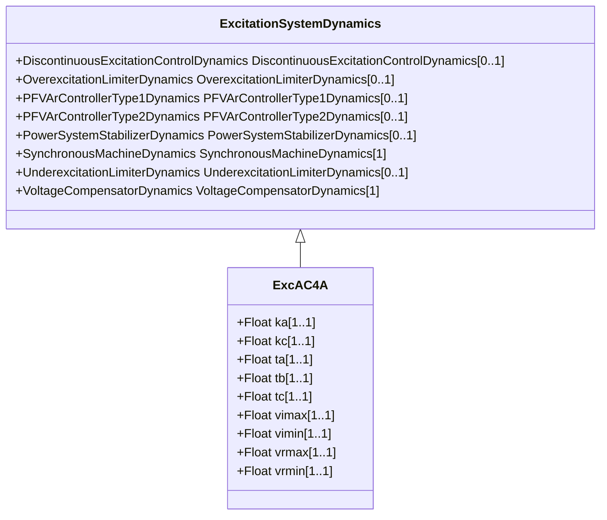

# ExcAC4A

Modified IEEE AC4A alternator-supplied rectifier excitation system with different minimum controller output.

## Inheritance

<button class="mermaid-enlarge-button">Enlarge Diagram</button>

## Attributes

| Label | Type | Multiplicity | Comment |
|-------|------|--------------|---------|
| ka | Float | 1..1 | Voltage regulator gain (Ka) (> 0). Typical value = 200. |
| kc | Float | 1..1 | Rectifier loading factor proportional to commutating reactance (Kc) (>= 0). Typical value = 0. |
| ta | Float | 1..1 | Voltage regulator time constant (Ta) (> 0). Typical value = 0,015. |
| tb | Float | 1..1 | Voltage regulator time constant (Tb) (>= 0). Typical value = 10. |
| tc | Float | 1..1 | Voltage regulator time constant (Tc) (>= 0). Typical value = 1. |
| vimax | Float | 1..1 | Maximum voltage regulator input limit (Vimax) (> 0). Typical value = 10. |
| vimin | Float | 1..1 | Minimum voltage regulator input limit (Vimin) (< 0). Typical value = -10. |
| vrmax | Float | 1..1 | Maximum voltage regulator output (Vrmax) (> 0). Typical value = 5,64. |
| vrmin | Float | 1..1 | Minimum voltage regulator output (Vrmin) (< 0). Typical value = -4,53. |

