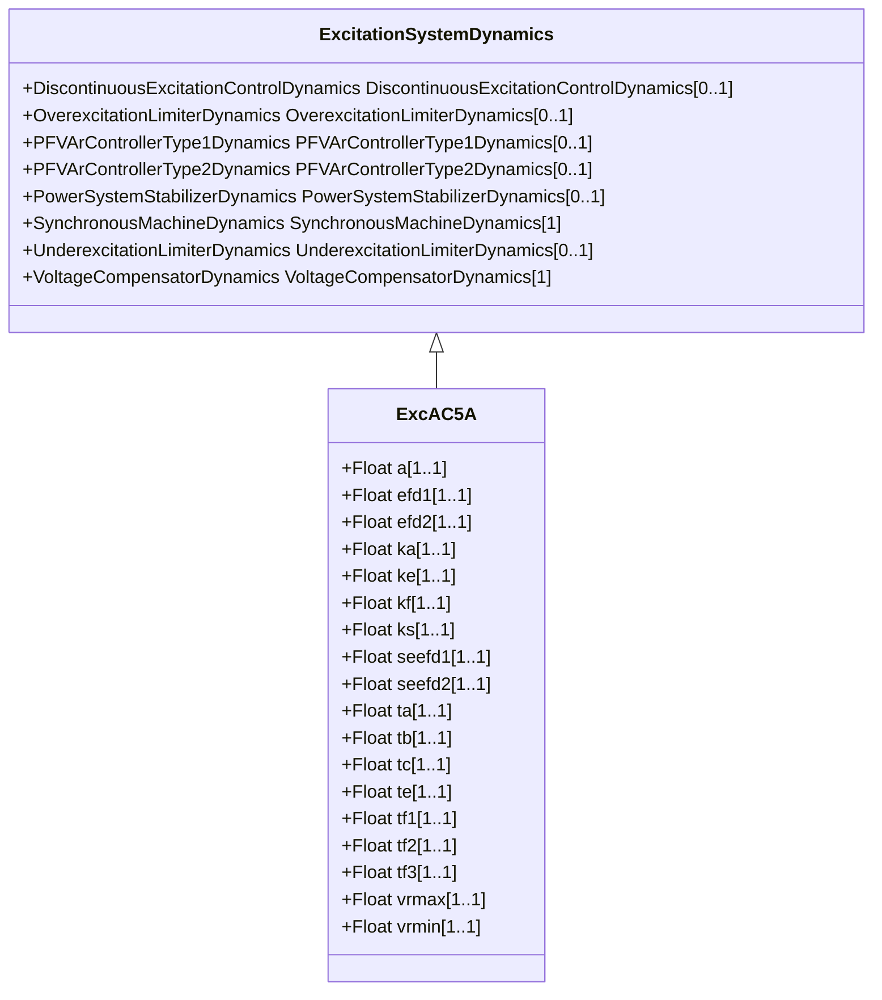

# ExcAC5A

Modified IEEE AC5A alternator-supplied rectifier excitation system with different minimum controller output.

## Inheritance

<button class="mermaid-enlarge-button">Enlarge Diagram</button>

## Attributes

| Label | Type | Multiplicity | Comment |
|-------|------|--------------|---------|
| a | Float | 1..1 | Coefficient to allow different usage of the model (a). Typical value = 1. |
| efd1 | Float | 1..1 | Exciter voltage at which exciter saturation is defined (Efd1) (> 0). Typical value = 5,6. |
| efd2 | Float | 1..1 | Exciter voltage at which exciter saturation is defined (Efd2) (> 0). Typical value = 4,2. |
| ka | Float | 1..1 | Voltage regulator gain (Ka) (> 0). Typical value = 400. |
| ke | Float | 1..1 | Exciter constant related to self-excited field (Ke). Typical value = 1. |
| kf | Float | 1..1 | Excitation control system stabilizer gains (Kf) (>= 0). Typical value = 0,03. |
| ks | Float | 1..1 | Coefficient to allow different usage of the model-speed coefficient (Ks). Typical value = 0. |
| seefd1 | Float | 1..1 | Exciter saturation function value at the corresponding exciter voltage, Efd1 (Se[Efd1]) (>= 0). Typical value = 0,86. |
| seefd2 | Float | 1..1 | Exciter saturation function value at the corresponding exciter voltage, Efd2 (Se[Efd2]) (>= 0). Typical value = 0,5. |
| ta | Float | 1..1 | Voltage regulator time constant (Ta) (> 0). Typical value = 0,02. |
| tb | Float | 1..1 | Voltage regulator time constant (Tb) (>= 0). Typical value = 0. |
| tc | Float | 1..1 | Voltage regulator time constant (Tc) (>= 0). Typical value = 0. |
| te | Float | 1..1 | Exciter time constant, integration rate associated with exciter control (Te) (> 0). Typical value = 0,8. |
| tf1 | Float | 1..1 | Excitation control system stabilizer time constant (Tf1) (> 0). Typical value = 1. |
| tf2 | Float | 1..1 | Excitation control system stabilizer time constant (Tf2) (>= 0). Typical value = 0,8. |
| tf3 | Float | 1..1 | Excitation control system stabilizer time constant (Tf3) (>= 0). Typical value = 0. |
| vrmax | Float | 1..1 | Maximum voltage regulator output (Vrmax) (> 0). Typical value = 7,3. |
| vrmin | Float | 1..1 | Minimum voltage regulator output (Vrmin) (< 0). Typical value =-7,3. |

