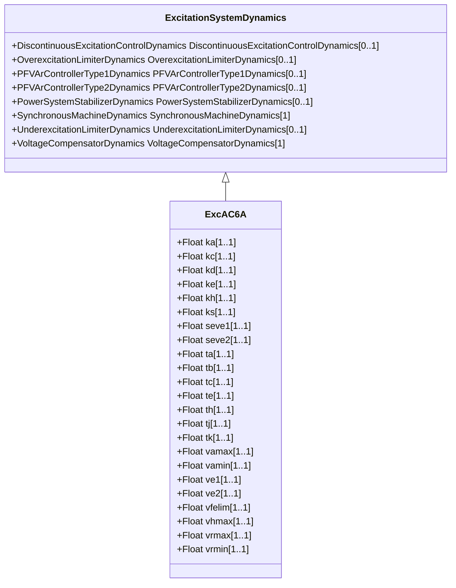

# ExcAC6A

Modified IEEE AC6A alternator-supplied rectifier excitation system with speed input.

## Inheritance

<button class="mermaid-enlarge-button">Enlarge Diagram</button>

## Attributes

| Label | Type | Multiplicity | Comment |
|-------|------|--------------|---------|
| ka | Float | 1..1 | Voltage regulator gain (Ka) (> 0). Typical value = 536. |
| kc | Float | 1..1 | Rectifier loading factor proportional to commutating reactance (Kc) (>= 0). Typical value = 0,173. |
| kd | Float | 1..1 | Demagnetizing factor, a function of exciter alternator reactances (Kd) (>= 0). Typical value = 1,91. |
| ke | Float | 1..1 | Exciter constant related to self-excited field (Ke). Typical value = 1,6. |
| kh | Float | 1..1 | Exciter field current limiter gain (Kh) (>= 0). Typical value = 92. |
| ks | Float | 1..1 | Coefficient to allow different usage of the model-speed coefficient (Ks). Typical value = 0. |
| seve1 | Float | 1..1 | Exciter saturation function value at the corresponding exciter voltage, Ve1, back of commutating reactance (Se[Ve1]) (>= 0). Typical value = 0,214. |
| seve2 | Float | 1..1 | Exciter saturation function value at the corresponding exciter voltage, Ve2, back of commutating reactance (Se[Ve2]) (>= 0). Typical value = 0,044. |
| ta | Float | 1..1 | Voltage regulator time constant (Ta) (>= 0). Typical value = 0,086. |
| tb | Float | 1..1 | Voltage regulator time constant (Tb) (>= 0). Typical value = 9. |
| tc | Float | 1..1 | Voltage regulator time constant (Tc) (>= 0). Typical value = 3. |
| te | Float | 1..1 | Exciter time constant, integration rate associated with exciter control (Te) (> 0). Typical value = 1. |
| th | Float | 1..1 | Exciter field current limiter time constant (Th) (> 0). Typical value = 0,08. |
| tj | Float | 1..1 | Exciter field current limiter time constant (Tj) (>= 0). Typical value = 0,02. |
| tk | Float | 1..1 | Voltage regulator time constant (Tk) (>= 0). Typical value = 0,18. |
| vamax | Float | 1..1 | Maximum voltage regulator output (Vamax) (> 0). Typical value = 75. |
| vamin | Float | 1..1 | Minimum voltage regulator output (Vamin) (< 0). Typical value = -75. |
| ve1 | Float | 1..1 | Exciter alternator output voltages back of commutating reactance at which saturation is defined (Ve1) (> 0). Typical value = 7,4. |
| ve2 | Float | 1..1 | Exciter alternator output voltages back of commutating reactance at which saturation is defined (Ve2) (> 0). Typical value = 5,55. |
| vfelim | Float | 1..1 | Exciter field current limit reference (Vfelim) (> 0). Typical value = 19. |
| vhmax | Float | 1..1 | Maximum field current limiter signal reference (Vhmax) (> 0). Typical value = 75. |
| vrmax | Float | 1..1 | Maximum voltage regulator output (Vrmax) (> 0). Typical value = 44. |
| vrmin | Float | 1..1 | Minimum voltage regulator output (Vrmin) (< 0). Typical value = -36. |

