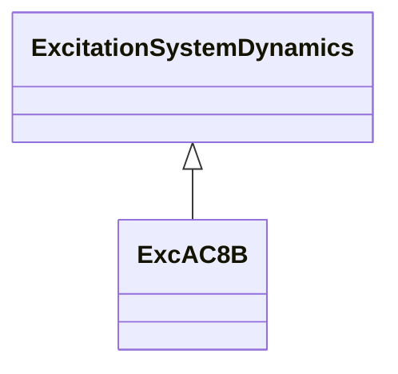

# ExcAC8B

Modified IEEE AC8B alternator-supplied rectifier excitation system with speed input and input limiter.

## Inheritance

<button class="mermaid-enlarge-button">Enlarge Diagram</button>

## Attributes

| Label | Type | Multiplicity | Comment |
|-------|------|--------------|---------|
| inlim | Boolean | 1..1 | Input limiter indicator. true = input limiter Vimax and Vimin is considered false = input limiter Vimax and Vimin is not considered. Typical value = true. |
| ka | Float | 1..1 | Voltage regulator gain (Ka) (> 0). Typical value = 1. |
| kc | Float | 1..1 | Rectifier loading factor proportional to commutating reactance (Kc) (>= 0). Typical value = 0,55. |
| kd | Float | 1..1 | Demagnetizing factor, a function of exciter alternator reactances (Kd) (>= 0). Typical value = 1,1. |
| kdr | Float | 1..1 | Voltage regulator derivative gain (Kdr) (>= 0). Typical value = 10. |
| ke | Float | 1..1 | Exciter constant related to self-excited field (Ke). Typical value = 1. |
| kir | Float | 1..1 | Voltage regulator integral gain (Kir) (>= 0). Typical value = 5. |
| kpr | Float | 1..1 | Voltage regulator proportional gain (Kpr) (> 0 if ExcAC8B.kir = 0). Typical value = 80. |
| ks | Float | 1..1 | Coefficient to allow different usage of the model-speed coefficient (Ks). Typical value = 0. |
| pidlim | Boolean | 1..1 | PID limiter indicator. true = input limiter Vpidmax and Vpidmin is considered false = input limiter Vpidmax and Vpidmin is not considered. Typical value = true. |
| seve1 | Float | 1..1 | Exciter saturation function value at the corresponding exciter voltage, Ve1, back of commutating reactance (Se[Ve1]) (>= 0). Typical value = 0,3. |
| seve2 | Float | 1..1 | Exciter saturation function value at the corresponding exciter voltage, Ve2, back of commutating reactance (Se[Ve2]) (>= 0). Typical value = 3. |
| ta | Float | 1..1 | Voltage regulator time constant (Ta) (>= 0). Typical value = 0. |
| tdr | Float | 1..1 | Lag time constant (Tdr) (> 0 if ExcAC8B.kdr > 0). Typical value = 0,1. |
| te | Float | 1..1 | Exciter time constant, integration rate associated with exciter control (Te) (> 0). Typical value = 1,2. |
| telim | Boolean | 1..1 | Selector for the limiter on the block (1/sTe). See diagram for meaning of true and false. Typical value = false. |
| ve1 | Float | 1..1 | Exciter alternator output voltages back of commutating reactance at which saturation is defined (Ve1) (> 0). Typical value = 6,5. |
| ve2 | Float | 1..1 | Exciter alternator output voltages back of commutating reactance at which saturation is defined (Ve2) (> 0). Typical value = 9. |
| vemin | Float | 1..1 | Minimum exciter voltage output (Vemin) (<= 0). Typical value = 0. |
| vfemax | Float | 1..1 | Exciter field current limit reference (Vfemax). Typical value = 6. |
| vimax | Float | 1..1 | Input signal maximum (Vimax) (> ExcAC8B.vimin). Typical value = 35. |
| vimin | Float | 1..1 | Input signal minimum (Vimin) (< ExcAC8B.vimax). Typical value = -10. |
| vpidmax | Float | 1..1 | PID maximum controller output (Vpidmax) (> ExcAC8B.vpidmin). Typical value = 35. |
| vpidmin | Float | 1..1 | PID minimum controller output (Vpidmin) (< ExcAC8B.vpidmax). Typical value = -10. |
| vrmax | Float | 1..1 | Maximum voltage regulator output (Vrmax) (> 0). Typical value = 35. |
| vrmin | Float | 1..1 | Minimum voltage regulator output (Vrmin) (< 0). Typical value = 0. |
| vtmult | Boolean | 1..1 | Multiply by generator's terminal voltage indicator. true =the limits Vrmax and Vrmin are multiplied by the generator’s terminal voltage to represent a thyristor power stage fed from the generator terminals false = limits are not multiplied by generator's terminal voltage. Typical value = false. |

