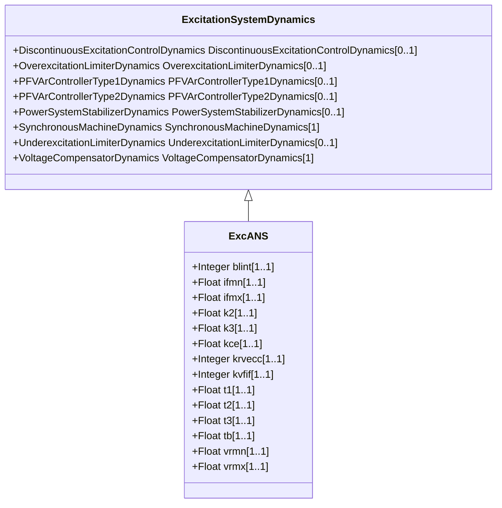

# ExcANS

Italian excitation system. It represents static field voltage or excitation current feedback excitation system.

## Inheritance

<button class="mermaid-enlarge-button">Enlarge Diagram</button>

## Attributes

| Label | Type | Multiplicity | Comment |
|-------|------|--------------|---------|
| blint | Integer | 1..1 | Governor control flag (BLINT). 0 = lead-lag regulator 1 = proportional integral regulator. Typical value = 0. |
| ifmn | Float | 1..1 | Minimum exciter current (IFMN). Typical value = -5,2. |
| ifmx | Float | 1..1 | Maximum exciter current (IFMX). Typical value = 6,5. |
| k2 | Float | 1..1 | Exciter gain (K2). Typical value = 20. |
| k3 | Float | 1..1 | AVR gain (K3). Typical value = 1000. |
| kce | Float | 1..1 | Ceiling factor (KCE). Typical value = 1. |
| krvecc | Integer | 1..1 | Feedback enabling (KRVECC). 0 = open loop control 1 = closed loop control. Typical value = 1. |
| kvfif | Integer | 1..1 | Rate feedback signal flag (KVFIF). 0 = output voltage of the exciter 1 = exciter field current. Typical value = 0. |
| t1 | Float | 1..1 | Time constant (T1) (>= 0). Typical value = 20. |
| t2 | Float | 1..1 | Time constant (T2) (>= 0). Typical value = 0,05. |
| t3 | Float | 1..1 | Time constant (T3) (>= 0). Typical value = 1,6. |
| tb | Float | 1..1 | Exciter time constant (TB) (>= 0). Typical value = 0,04. |
| vrmn | Float | 1..1 | Minimum AVR output (VRMN). Typical value = -5,2. |
| vrmx | Float | 1..1 | Maximum AVR output (VRMX). Typical value = 6,5. |

