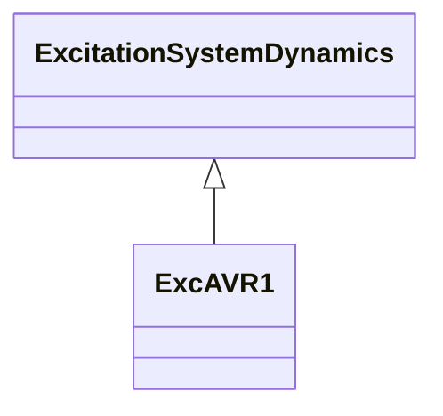

# ExcAVR1

Italian excitation system corresponding to IEEE (1968) type 1 model. It represents an exciter dynamo and electromechanical regulator.

## Inheritance

<button class="mermaid-enlarge-button">Enlarge Diagram</button>

## Attributes

| Label | Type | Multiplicity | Comment |
|-------|------|--------------|---------|
| e1 | Float | 1..1 | Field voltage value 1 (E1). Typical value = 4.18. |
| e2 | Float | 1..1 | Field voltage value 2 (E2). Typical value = 3,14. |
| ka | Float | 1..1 | AVR gain (KA). Typical value = 500. |
| kf | Float | 1..1 | Rate feedback gain (KF). Typical value = 0,12. |
| se1 | Float | 1..1 | Saturation factor at E1 (S[E1]). Typical value = 0,1. |
| se2 | Float | 1..1 | Saturation factor at E2 (S[E2]). Typical value = 0,03. |
| ta | Float | 1..1 | AVR time constant (TA) (>= 0). Typical value = 0,2. |
| tb | Float | 1..1 | AVR time constant (TB) (>= 0). Typical value = 0. |
| te | Float | 1..1 | Exciter time constant (TE) (>= 0). Typical value = 1. |
| tf | Float | 1..1 | Rate feedback time constant (TF) (>= 0). Typical value = 1. |
| vrmn | Float | 1..1 | Minimum AVR output (VRMN). Typical value = -6. |
| vrmx | Float | 1..1 | Maximum AVR output (VRMX). Typical value = 7. |

