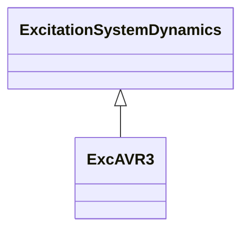

# ExcAVR3

Italian excitation system. It represents an exciter dynamo and electric regulator.

## Inheritance

<button class="mermaid-enlarge-button">Enlarge Diagram</button>

## Attributes

| Label | Type | Multiplicity | Comment |
|-------|------|--------------|---------|
| e1 | Float | 1..1 | Field voltage value 1 (E1). Typical value = 4,18. |
| e2 | Float | 1..1 | Field voltage value 2 (E2). Typical value = 3,14. |
| ka | Float | 1..1 | AVR gain (KA). Typical value = 100. |
| se1 | Float | 1..1 | Saturation factor at E1 (S[E1]). Typical value = 0,1. |
| se2 | Float | 1..1 | Saturation factor at E2 (S[E2]). Typical value = 0,03. |
| t1 | Float | 1..1 | AVR time constant (T1) (>= 0). Typical value = 20. |
| t2 | Float | 1..1 | AVR time constant (T2) (>= 0). Typical value = 1,6. |
| t3 | Float | 1..1 | AVR time constant (T3) (>= 0). Typical value = 0,66. |
| t4 | Float | 1..1 | AVR time constant (T4) (>= 0). Typical value = 0,07. |
| te | Float | 1..1 | Exciter time constant (TE) (>= 0). Typical value = 1. |
| vrmn | Float | 1..1 | Minimum AVR output (VRMN). Typical value = -7,5. |
| vrmx | Float | 1..1 | Maximum AVR output (VRMX). Typical value = 7,5. |

