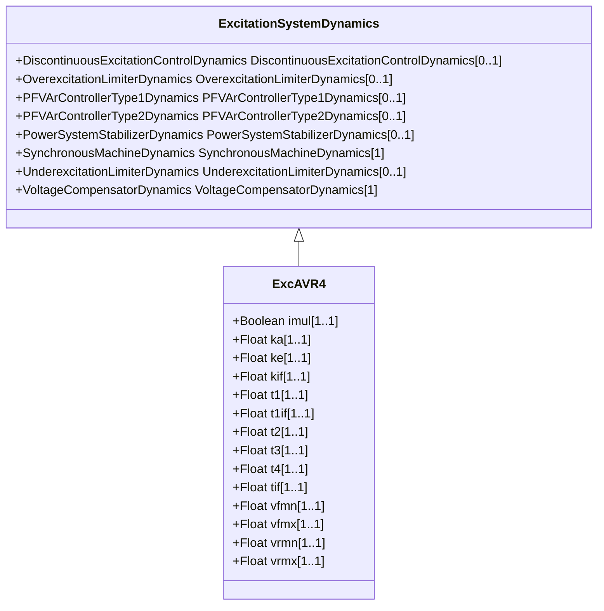

# ExcAVR4

Italian excitation system. It represents a static exciter and electric voltage regulator.

## Inheritance

<button class="mermaid-enlarge-button">Enlarge Diagram</button>

## Attributes

| Label | Type | Multiplicity | Comment |
|-------|------|--------------|---------|
| imul | Boolean | 1..1 | AVR output voltage dependency selector (IMUL). true = selector is connected false = selector is not connected. Typical value = true. |
| ka | Float | 1..1 | AVR gain (KA). Typical value = 300. |
| ke | Float | 1..1 | Exciter gain (KE). Typical value = 1. |
| kif | Float | 1..1 | Exciter internal reactance (KIF). Typical value = 0. |
| t1 | Float | 1..1 | AVR time constant (T1) (>= 0). Typical value = 4,8. |
| t1if | Float | 1..1 | Exciter current feedback time constant (T1IF) (>= 0). Typical value = 60. |
| t2 | Float | 1..1 | AVR time constant (T2) (>= 0). Typical value = 1,5. |
| t3 | Float | 1..1 | AVR time constant (T3) (>= 0). Typical value = 0. |
| t4 | Float | 1..1 | AVR time constant (T4) (>= 0). Typical value = 0. |
| tif | Float | 1..1 | Exciter current feedback time constant (TIF) (>= 0). Typical value = 0. |
| vfmn | Float | 1..1 | Minimum exciter output (VFMN). Typical value = 0. |
| vfmx | Float | 1..1 | Maximum exciter output (VFMX). Typical value = 5. |
| vrmn | Float | 1..1 | Minimum AVR output (VRMN). Typical value = 0. |
| vrmx | Float | 1..1 | Maximum AVR output (VRMX). Typical value = 5. |

