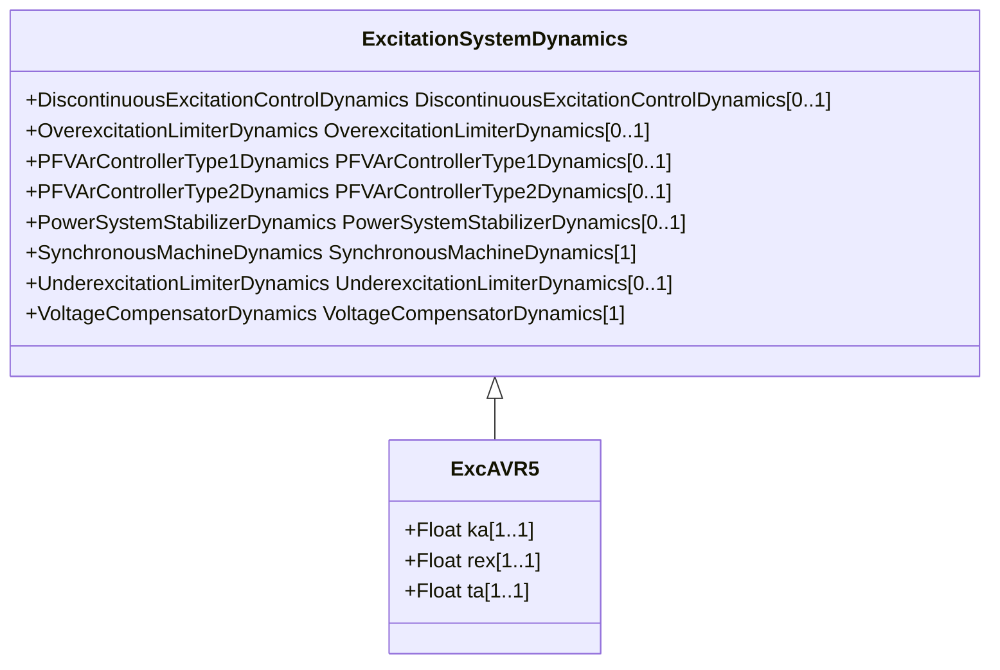

# ExcAVR5

Manual excitation control with field circuit resistance. This model can be used as a very simple representation of manual voltage control.

## Inheritance

<button class="mermaid-enlarge-button">Enlarge Diagram</button>

## Attributes

| Label | Type | Multiplicity | Comment |
|-------|------|--------------|---------|
| ka | Float | 1..1 | Gain (Ka). |
| rex | Float | 1..1 | Effective output resistance (Rex). Rex represents the effective output resistance seen by the excitation system. |
| ta | Float | 1..1 | Time constant (Ta) (>= 0). |

