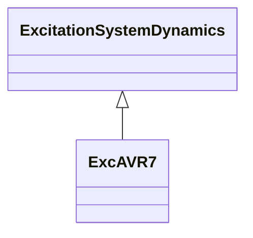

# ExcAVR7

IVO excitation system.

## Inheritance

<button class="mermaid-enlarge-button">Enlarge Diagram</button>

## Attributes

| Label | Type | Multiplicity | Comment |
|-------|------|--------------|---------|
| a1 | Float | 1..1 | Lead coefficient (A1). Typical value = 0,5. |
| a2 | Float | 1..1 | Lag coefficient (A2). Typical value = 0,5. |
| a3 | Float | 1..1 | Lead coefficient (A3). Typical value = 0,5. |
| a4 | Float | 1..1 | Lag coefficient (A4). Typical value = 0,5. |
| a5 | Float | 1..1 | Lead coefficient (A5). Typical value = 0,5. |
| a6 | Float | 1..1 | Lag coefficient (A6). Typical value = 0,5. |
| k1 | Float | 1..1 | Gain (K1). Typical value = 1. |
| k3 | Float | 1..1 | Gain (K3). Typical value = 3. |
| k5 | Float | 1..1 | Gain (K5). Typical value = 1. |
| t1 | Float | 1..1 | Lead time constant (T1) (>= 0). Typical value = 0,05. |
| t2 | Float | 1..1 | Lag time constant (T2) (>= 0). Typical value = 0,1. |
| t3 | Float | 1..1 | Lead time constant (T3) (>= 0). Typical value = 0,1. |
| t4 | Float | 1..1 | Lag time constant (T4) (>= 0). Typical value = 0,1. |
| t5 | Float | 1..1 | Lead time constant (T5) (>= 0). Typical value = 0,1. |
| t6 | Float | 1..1 | Lag time constant (T6) (>= 0). Typical value = 0,1. |
| vmax1 | Float | 1..1 | Lead-lag maximum limit (Vmax1) (> ExcAVR7.vmin1). Typical value = 5. |
| vmax3 | Float | 1..1 | Lead-lag maximum limit (Vmax3) (> ExcAVR7.vmin3). Typical value = 5. |
| vmax5 | Float | 1..1 | Lead-lag maximum limit (Vmax5) (> ExcAVR7.vmin5). Typical value = 5. |
| vmin1 | Float | 1..1 | Lead-lag minimum limit (Vmin1) (< ExcAVR7.vmax1). Typical value = -5. |
| vmin3 | Float | 1..1 | Lead-lag minimum limit (Vmin3) (< ExcAVR7.vmax3). Typical value = -5. |
| vmin5 | Float | 1..1 | Lead-lag minimum limit (Vmin5) (< ExcAVR7.vmax5). Typical value = -2. |

